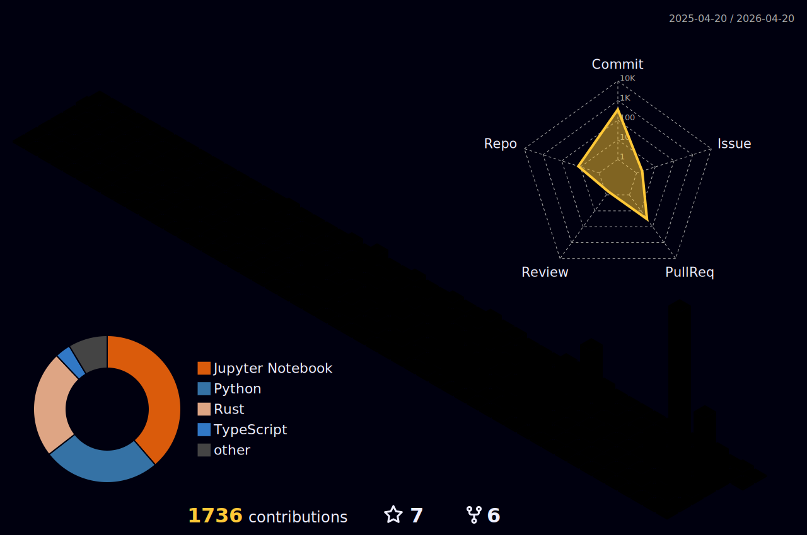

<h7 align= 'center'>
  
> Profissional com mais de 9 anos de experiência abrangendo diversos setores, incluindo Industrial, Militar e de
Defesa, Possuo habilidades de análise de dados com `Python`, `RStudio`, `SQL`, `Tableau` e uso de ferramentas como `Jupyter Notebook`,
`PostgreSQL`, `BigQuery`, e Proficiente no uso das bibliotecas Python: Pandas, Numpy, Scipy, Matplotlib, Seaborn, Statsmodels, Scikit-learn, AutoTS. E experiência com `Econometria Teórica e Aplicada`, `Análise Preditivas de Séries Temporais` e `Inferência Estatística`. Sou dedicado a constante aprendizagem, com o
objetivo de enfrentar desafios complexos e impulsionar a decisão baseada em dados.
<h7 align= 'center'>

  

</h5>

  

             
<h3 align='center'>
  Setup Remoto 💻  
   
  
  
  
  
</h3>

<h3 align='center'>
  Ferramentas 🪛

 
  
  
  
     
  

 

  
</h3>
<h3 align='center'>
  Bibliotecas Python

 
  
  
  
     

</h3>
<h3 align='center'>
    Perfis Profissionais
</h3>

 
    
    

   
<b>Contagem de Visitantes do Perfil</b>
  
    

 
   

