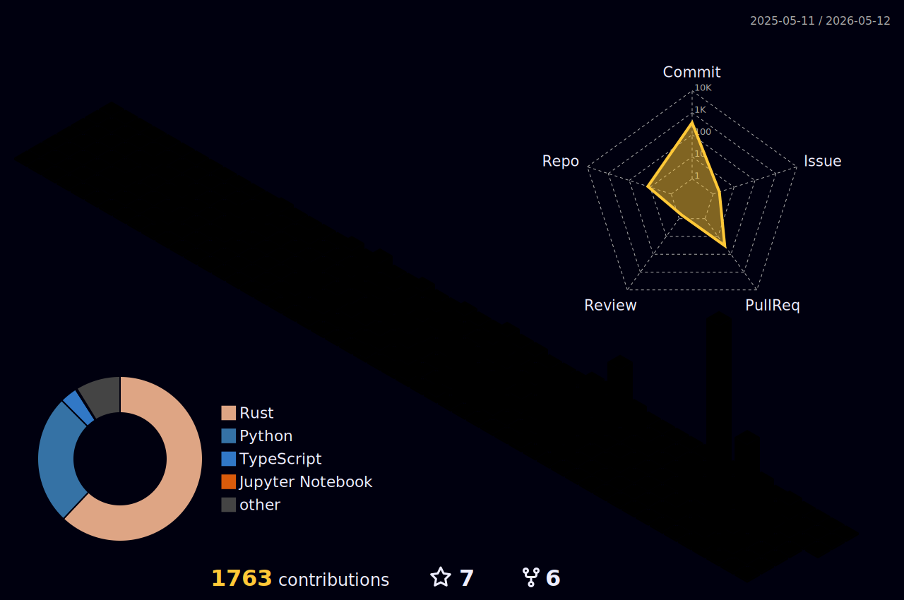

> Senior Data Scientist, AI Engineer and Quantitative Trader & Researcher with a strong background in machine learning, Quantitative techniques, signal extraction, alpha research, stochastic math, finacial data, and medium-frequency-trading, gamma scalping, delta hedging and predictive modeling.
>
> Skilled in developing intelligent solutions using advanced frameworks and cloud technologies, particularly in AWS, Oracle Cloud and GCP. Adept at designing and implementing AI-driven projects, such as generative AI agentic workflows, semantic search, agentic RAG, GraphRAG, and quantitative research.

  

  

<h3 align='center'>
 Remote Setup 💻  
  
    
    

    
    
  

  

  
  
  

</h3>

<h3 align='center'>Languages</h3>

  
  

  
  

  
  
  

  

<h3 align='center'>Tools</h3>

  
  
  
  
  
  
  
  
  
  
  
  
  

 

<h3 align="center">
  Libraries and Frameworks (Python)
</h3>

  
  
  
  
  
  
  
  
  
  
  
  
  
  
  
  
  
  

<h3 align='center'>
   Professional Profiles (Click to pay a Visit 😜)
</h3>

  
  
  
  
  

   
  
<b>Profile Visitor Count</b>

  

    
  

 

