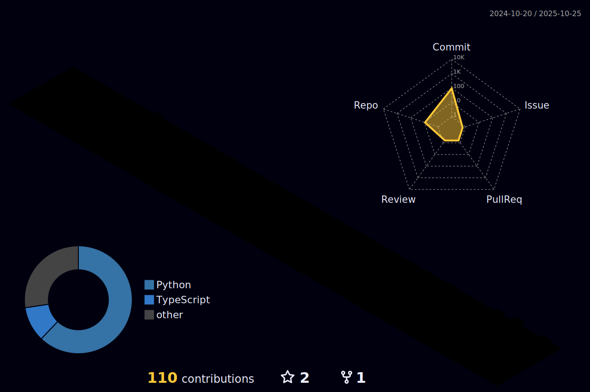

<h7 align= 'center'>
  
> Data Scientist specialized in predictive modeling and causal inference, focused on data
analysis and applying machine learning techniques. Experienced in statistics, time
series, econometrics, heuristics and predictive model development.
Skilled in Python and R for statistical modeling and machine learning, with a strong foundation in
algorithms, data structures,probability, and statistics.

> Currently focused on the development of AI agents using the LangChain framework, integrating state-of-the-art natural language processing and generative AI capabilities.
<h7 align= 'center'>

  

</h5>

  

  

             
<h3 align='center'>
 Remote Setup 💻  
   
  

    
    
  

  

  
  
  

</h3>

<h3 align='center'>
  Tools 🪛

 
  
 
    
    
    
   
 
  
 
    
    
    
  

  
 
  
     
   

  

 

  
</h3>
<h3 align="center">
  Python Libraries 
</h3>

  

    
    
    
  

  

       
    
    
  

  

    
    
    
  

</h3>
<h3 align='center'>
   Professional Profiles (Click to pay a Visit 😜) 
</h3>

 
  

    
    
  

  

    
    <a href="https://www.workana.com/freelancer/586ac78626cc57098868f4b48699e405">
      
    

    
      <a href="http://pph.me/SamoraDC">
        

   
<b>Profile Visitor Count</b>
  
    

 
   

